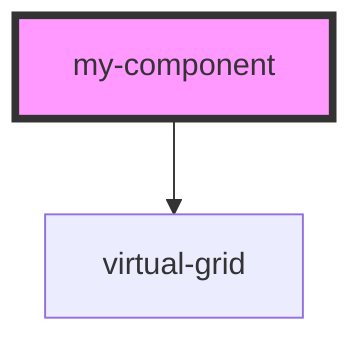

# my-component

<!-- Auto Generated Below -->

## Dependencies

### Depends on

- [virtual-grid](../virtual-grid)

### Graph

----------------------------------------------

*Built with [StencilJS](https://stenciljs.com/)*
