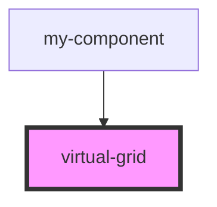

# virtual-grid

<!-- Auto Generated Below -->

## Properties

| Property       | Attribute        | Description | Type                       | Default     |
| -------------- | ---------------- | ----------- | -------------------------- | ----------- |
| `itemMaxWidth` | `item-max-width` |             | `number`                   | `200`       |
| `items`        | `items`          |             | `any[]`                    | `[]`        |
| `renderItem`   | `render-item`    |             | `(index: number) => VNode` | `undefined` |

## Dependencies

### Used by

 - [my-component](../my-component)

### Graph

----------------------------------------------

*Built with [StencilJS](https://stenciljs.com/)*
